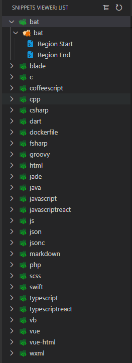
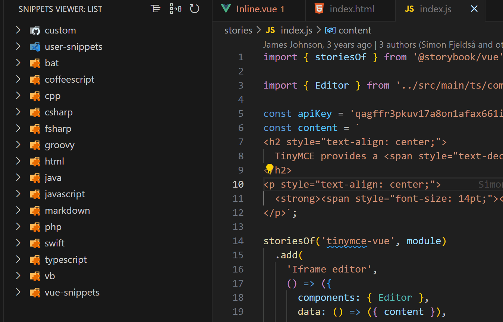
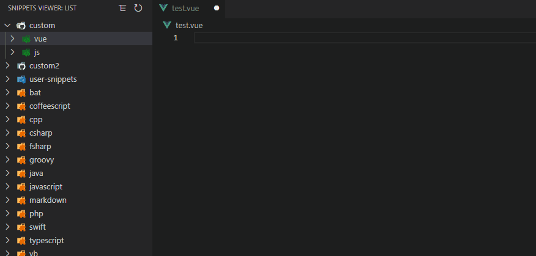
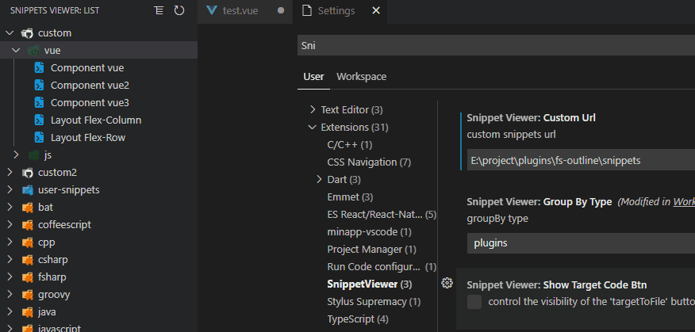

# vscode-snippets-viewer
Snippets Viewer for Visual Studio Code
[Visual Studio Marketplace](https://marketplace.visualstudio.com/items?itemName=shilim.vscode-snippets-viewer)

## Auto Loading Snippets From Expansion
You can easily view all extended code snippets from the sidebar<br/>

**GroupByPlugins**


**GroupByLanguage**



## Usage
### Insert Snippets
Click code snippet
### Change ShowType
Update `User Settings` to config
Click the 'showAll'|'followEditor' button in the upper right corner

if 'followEditor' is selected, only the snippet for the language corresponding to the activated editor will be displayed

### Change GroupByType
Update `User Settings` to config
Click the 'Group By xxx' button in the upper right corner<br/>

### Refresh List
Click the refresh button in the upper right corner

#### Disable/Enable Custom Snippets
Only support for custom snippets


## Options
The following Visual Studio Code setting is available for the Snippets-Viewer. This can be set in `User Settings` or `Workspace Settings`.

```javascript
{
    // custom absolute snippet folder url,it will query the configuration file you configured
    "SnippetViewer.customUrl":"E:\\snippets",
    // custom relative snippet folder url,it will query the configuration file in the currently open folder
    "SnippetViewer.relativeCustomUrl":".vscode",
    // show type default:'showAll'
    "SnippetViewer.showType":"showAll"
    // groupByType default:'plugins'
    "SnippetViewer.groupByType":"plugins"
    // control the visibility of the 'targetToFile' button default:false
    "SnippetViewer.showTargetCodeBtn":false
}
```
#### Custom Snippets
Snippets code folder template. You can refer to the `snippets` folder
```
snippets                          
├─ custom    
│  └─ vue.json
│  └─ javacript.json                 
└─ config.json               
```
config.json template
```json
[
  {
    "name": "custom",
    "children": [
      {
        "name": "vue",
        "children": "custom/vue.json"
      }
    ]
  }
]
```

#### Target To Snippets File
When SnippetViewer.showTargetCodeBtn is True, you can get a button to open the snippets file.

