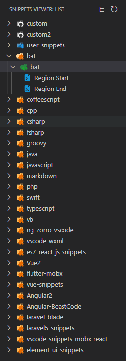

# vscode-snippets-viewer
Snippets Viewer for Visual Studio Code
## Auto Loading Snippets From Expansion
You can easily view all extended code snippets from the sidebar

## Usage
### Insert Snippets
Click code snippet
### Refresh List
Click the refresh button in the upper right corner
## Options
The following Visual Studio Code setting is available for the Snippets-Viewer. This can be set in `User Settings` or `Workspace Settings`.

```javascript
{
    // custom snippet folder url
    "SnippetViewer.customUrl":"E:\\snippets"
}
```
#### Custom Snippets
Snippets code folder template. You can refer to the `snippets` folder
```
snippets                          
├─ custom    
│  └─ vue.json
│  └─ javacript.json                 
└─ config.json               
```
config.json template
```json
[
  {
    "name": "custom",
    "children": [
      {
        "name": "vue",
        "children": "custom/vue.json"
      }
    ]
  }
]
```